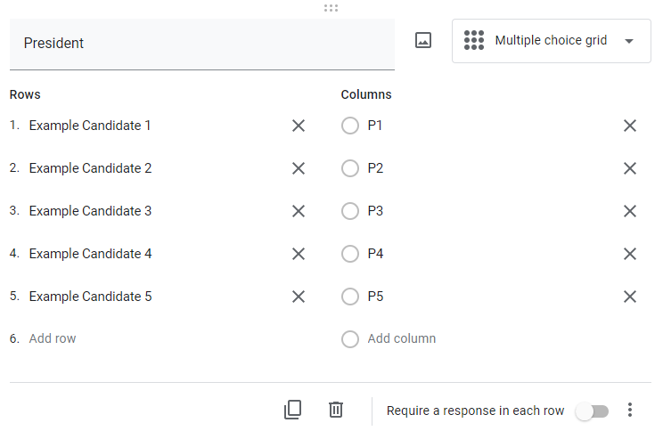
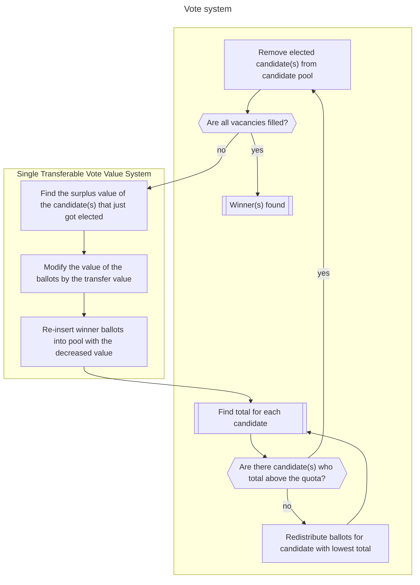
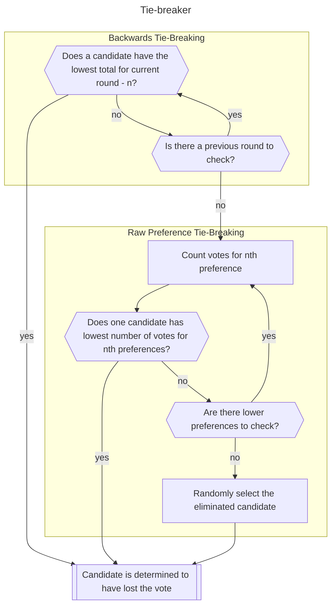

This is a Python script used to run an Instant Runoff Vote election using Google Forms.

This was built specifically to handle elections for the Students of Florey Institute committee, where multiple positions are elected at once. To make things easiest for the voters, the single Google Form allows voting across all of these positions (although this script can work for a single position too).

# Usage

`python googleform-irv.py path/to/file.csv`

We can also run the script on a particular role if there are exclusion requirements (e.g. someone was nominated for and won two positions, but they can only accept one). We use the form `python googleform-irv.py path/to/file.csv --role Education Officer --exclude "Hingle McCringleberry" "Benedict Cumberbatch"`. Here, `--excude` is used to add names to a list, which will be filtered out from the voting for a particular role. 

# Settings up the Google Form

## Question structure requirements

An election for one role is conducted using the `Multiple Choice Grid` question type in the Google Form.

- The question name is the role
- Each Row is a candidate
- There are *n* Columns of P1, P2… P*n* where *n* = the number of candidates



The output format in the .csv for this type of question is a column for each candidate, in the format `Question String [Row String]`, so for a a question of Vice President with candidates Aunty Donna and Chips McGee, there are columns `Vice President [Aunty Donna]` and `Vice President [Chips McGee]`. Each row in the .csv contains a voters preference (e.g. “P1”) for a given candidate for a given role.

In the additional settings, make sure ***Limit to one response per column*** is active! This ensures that it’s impossible to mark down two candidates with the same preference. *Shuffle row order* (in the same menu) can also be used to reduce the effect of donkey voting.

The Python script is built to handle this format.

## Logistics

I’ll go through some settings used in my Google Forms

- In order to verify voter ID, the email addresses and names of the voters are collected. This is examined separately to the preferences (by blanking out the cells with preferences) to ensure that all voters are legitimate
- I don’t tick “Require a response in each row”, as it’s within a voter’s rights to not vote for something too.
- Requiring sign-in and its associated sub-settings could help against false voter attacks, if that’s a problem.
- The .csv file can be downloaded directly from the three dot menu in the Responses section of the form
- To protect against internal tampering, you can use “Link to Sheets” inside the Responses section and share the linked sheet with collaborators
  - The only way to tamper within the Form is to delete responses, or to change the order of the Rows
  - Deleting a response within the Form does not delete it from the Sheet
  - Changing the Row in a question will change the Form, which will be recorded in the Tracked Changes of the Sheet and attributed to “Form Responses”
    - (e.g. if Row 1 wins the vote, you could swap the names of Row 1 and Row 2, making the name that was originally in Row 2 “win”)

# Voting system: Single Transferable Vote

It’s described in the flowchart below, and also in [the Australian Electoral Commission’s Senate vote counting guide](https://www.aec.gov.au/learn/files/poster-count-senate-pref-voting.pdf). The quota is determined using the following:

```math
\textrm{quota}=\lfloor\frac{\textrm{\# formal votes}}{\textrm{\# vacancies} + 1}\rfloor + 1
```

In essence, with 100 ballots and 1 vacancy the quota would be 51, with 2 vacancies the quota would be 34.

If the position being elected has only one winner, then the quota is going to be a majority and the transfer of value will never happen (in the flowchart “Are the required number of positions filled?” can only be Yes).

If, after a round of counting, a number of candidates have passed the quota and not all vacancies have been filled the transfer system is activated. Once a candidate wins a position, their votes are redistributed into the pool with decreased value:

```math
\textrm{surplus} = \textrm{\# total votes} - \textrm{quota}
```

```math
\textrm{transfer value} = \frac{\textrm{surplus}}{\textrm{\# total votes}}$
```

The votes that contributed to the winning candidate then have their value multiplied (decreased) by $\textrm{transfer value}$.

The rationale is that if there was a surplus, then technically there are votes that have no home to go to. Since it’s impossible to determine which votes were *the* key contributors, all of the votes are devalued and redistributed.




## Ties

In the event that two or more candidates all receive the lowest number of first preferences, a tie-breaker is initiated. There are many tie-breaking methods, all of them with different properties.

Two algorithms have been implemented: Backwards Tie-Breaking and Raw Preference Tie-Breaking.

Backwards Tie-Breaking iteratively looks to backwards to previous rounds and eliminates one of the tied candidates in a recent round. If that fails, then we move to Raw Preference Tie-Breaking, where we use raw preferences. Raw Preference still utilises the value of the vote (which can change following a transfer after surplus).




## Formal votes

The Australian Electoral Commission’s guidelines to the formality of ballot papers is 41 pages. Luckily, an electronic vote leaves a lot less to guess work.

In my implementation, to be included in the count, a vote:

- Must have a first preference
- Must have preferences given in sequence
  - 1, 2, 3, 4 is formal
  - 1, 3, 4 is informal (intent regarding second preference unclear — did they miss one?)
- Need not have all preferences given
  - With 10 candidates, a voter may specify 1, 2, 3, or even just 1


# Changelog

- 2022-01-28: first release
